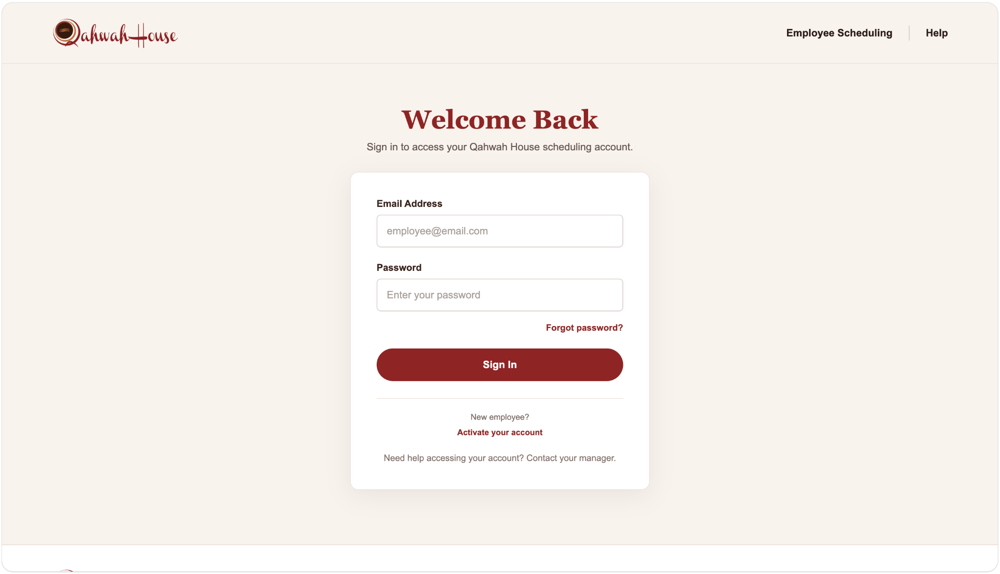
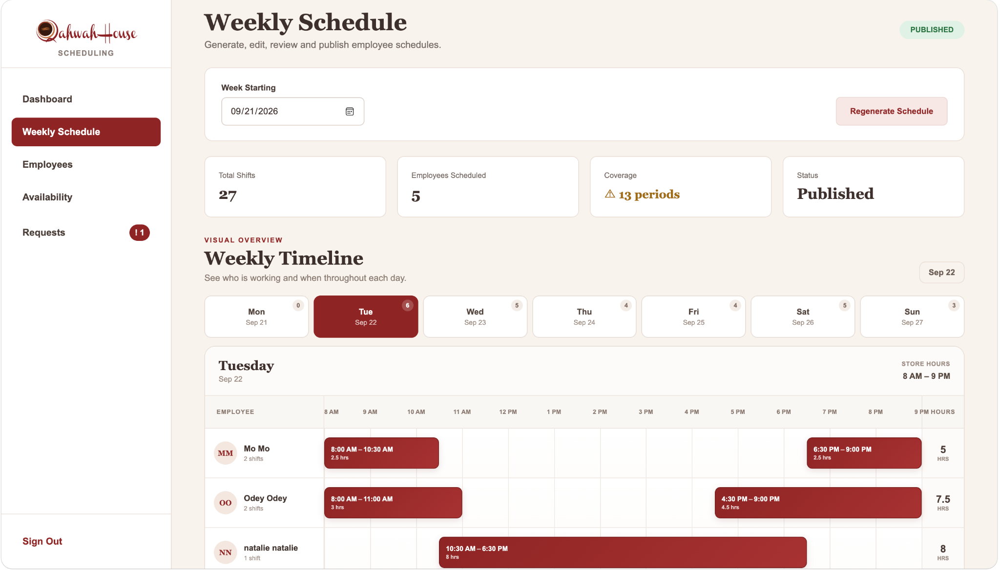
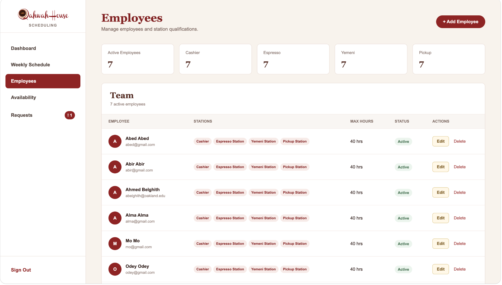
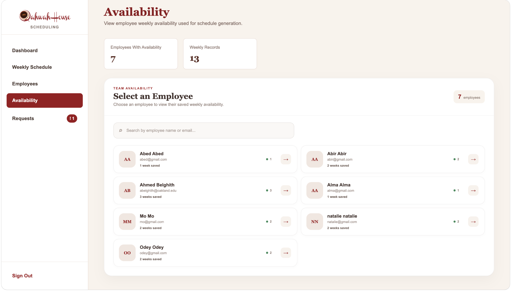
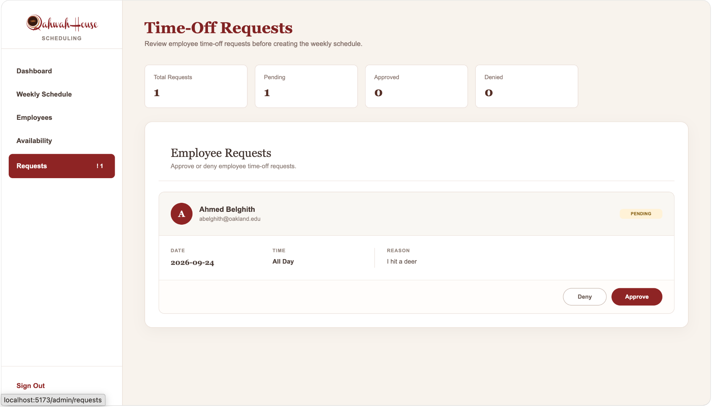
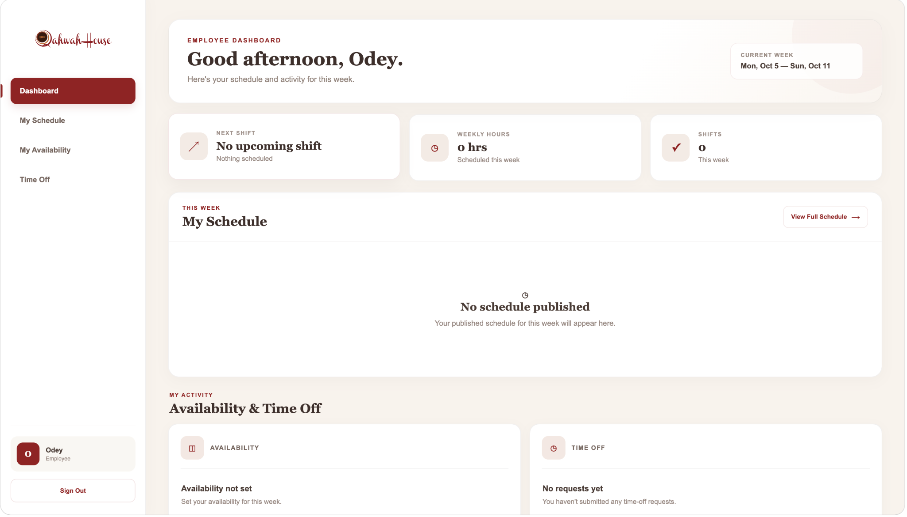
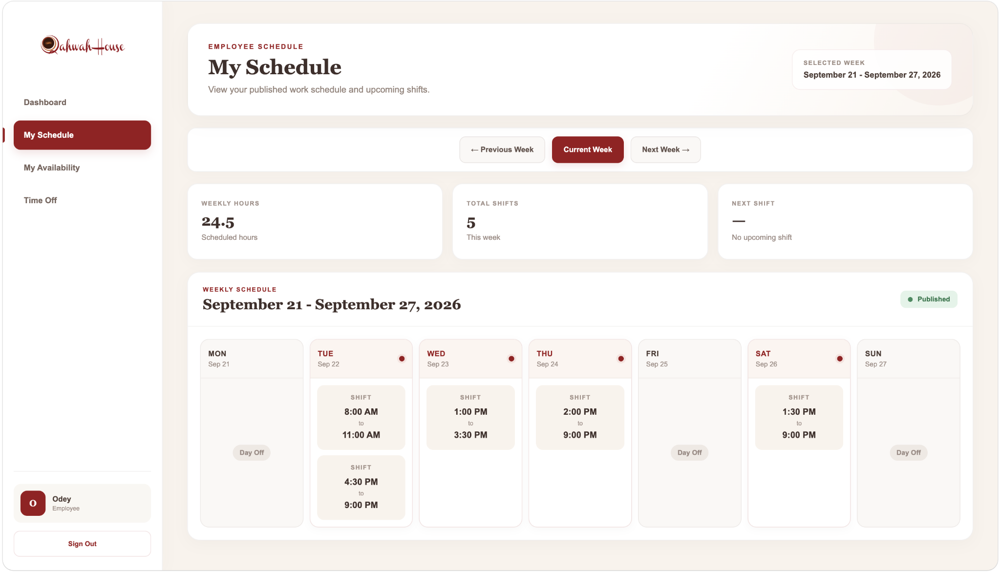
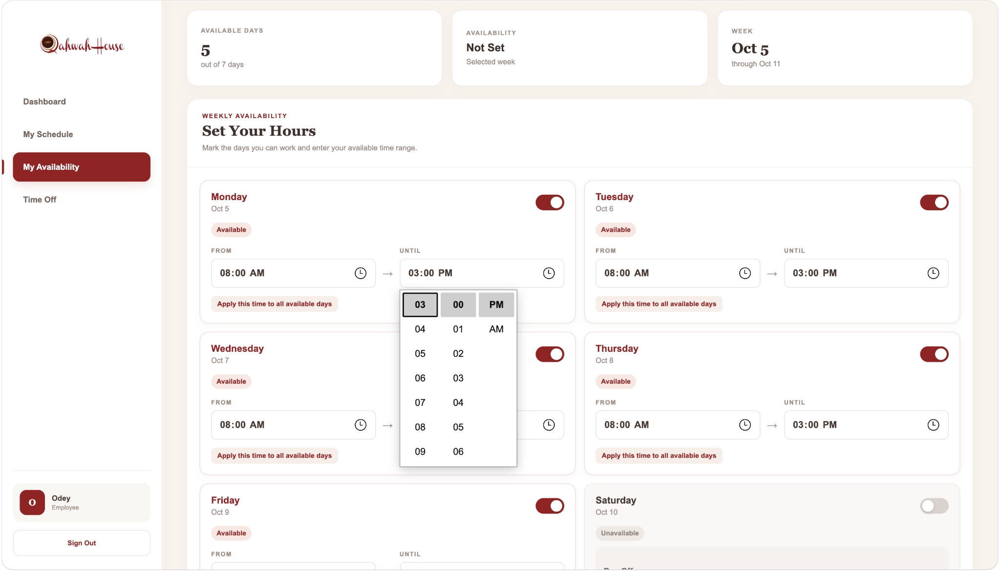
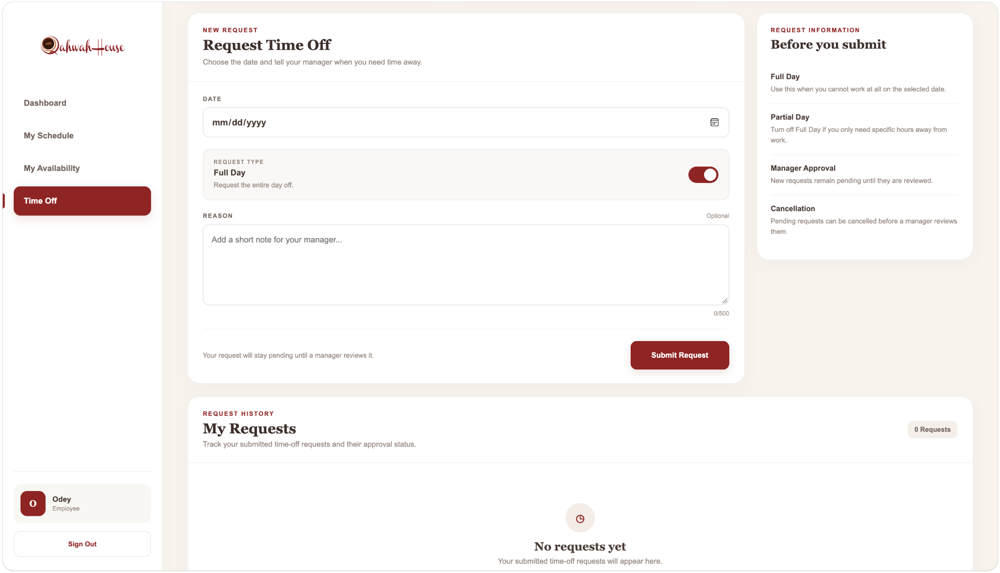

# Qahwah House Employee Scheduling System

A full-stack employee scheduling and workforce management application designed to simplify weekly scheduling for a coffee shop environment.

The application allows managers to manage employees, review availability and time-off requests, automatically generate optimized weekly schedules, manually adjust shifts, identify staffing shortages, and publish finalized schedules to employees.

Employees have their own dashboard where they can manage weekly availability, submit time-off requests, and view their published schedules.

The scheduling engine is built with **Google OR-Tools CP-SAT**, allowing the system to generate schedules based on real operational constraints rather than simply assigning shifts randomly.

## Live Application

**Production:** https://qahwah-house-scheduling.vercel.app

> This project was developed as a full-stack software engineering project and is not an official Qahwah House production system.

---

## Application Screenshots

### Authentication

The application provides secure authentication and role-based access for managers and employees.

<p align="center">
  
</p>

---

### Manager — Weekly Schedule

Managers can generate, review, manually adjust, and publish weekly schedules. The schedule timeline provides a visual overview of employee shifts and highlights staffing coverage issues.

<p align="center">
  
</p>

### Manager — Employee Management

Managers can manage employees, station qualifications, employment status, and weekly hour limits.

<p align="center">
  
</p>

### Manager — Employee Availability

Employee availability is stored by week and made available to the scheduling engine when generating schedules.

<p align="center">
  
</p>

### Manager — Time-Off Requests

Managers can review employee time-off requests and approve or deny them before generating a schedule.

<p align="center">
  
</p>

---

### Employee Dashboard

Employees have a dedicated dashboard showing their weekly hours, upcoming shifts, schedule status, availability, and time-off activity.

<p align="center">
  
</p>

### Employee Schedule

Employees can view published schedules while navigating between previous, current, and upcoming weeks.

<p align="center">
  
</p>

### Employee Availability

Employees can define the days and hours they are available to work. This availability becomes a scheduling constraint used by the optimization engine.

<p align="center">
  
</p>

### Employee Time-Off

Employees can submit full-day or partial-day time-off requests and track their approval status.

<p align="center">
  
</p>

## Key Features

### Manager / Admin

Managers have access to a dedicated administrative dashboard where they can:

- Create, edit, and manage employees
- Assign employees to one or more station qualifications
- Configure maximum weekly hours
- View employee availability
- Review and approve or deny time-off requests
- Generate optimized weekly schedules
- Detect periods with insufficient staffing
- Add, edit, or delete shifts manually
- Override availability conflicts when necessary
- Review schedule warnings before publishing
- Publish finalized schedules
- View pending time-off request notifications

### Employee

Employees have a separate authenticated experience where they can:

- Activate their employee account
- Sign in securely
- View their current published schedule
- View weekly scheduled hours
- See their next upcoming shift
- Submit weekly availability
- Modify current and future availability
- Submit full-day or partial-day time-off requests
- Track time-off request status
- Cancel pending time-off requests

Employees only receive schedules that have been officially published by a manager.

---

# Scheduling Optimization

One of the main technical components of this project is the automatic scheduling engine.

Instead of using simple procedural scheduling logic, the application models employee scheduling as a **constraint optimization problem** using:

**Google OR-Tools CP-SAT**

The optimizer runs as a Python service while the primary application backend is built with Node.js and Express.

## Scheduling Constraints

The optimizer divides each business day into **30-minute scheduling blocks**.

It considers:

- Employee weekly availability
- Approved time-off requests
- Store operating hours
- Maximum 8 working hours per employee per day
- Maximum 40 working hours per employee per week
- Required staffing coverage

Current staffing target:

```text
2 employees per 30-minute period
```

Store scheduling hours:

```text
Sunday – Thursday: 8:00 AM – 9:00 PM
Friday – Saturday: 8:00 AM – 10:00 PM
```

Employee availability and approved time off are treated as scheduling restrictions, meaning the automatic optimizer does not intentionally assign employees during those unavailable periods.

---

## Optimization Objective

The CP-SAT model does more than search for any valid schedule.

It minimizes a weighted objective:

```python
model.Minimize(
    total_shortage * 10000
    + total_shift_starts * 100
    + max_employee_blocks
)
```

This gives the optimizer three priorities.

### 1. Minimize Staffing Shortages

Coverage is the highest priority.

The optimizer attempts to maintain the required number of employees throughout operating hours.

### 2. Prefer Continuous Shifts

Every additional shift start receives a penalty.

This discourages schedules such as:

```text
8:00 AM – 9:00 AM
11:00 AM – 12:00 PM
3:00 PM – 4:00 PM
```

when a more continuous shift is possible.

### 3. Balance Employee Hours

The model also minimizes the maximum number of blocks assigned to an individual employee.

This encourages hours to be distributed more evenly rather than unnecessarily concentrating them on one employee.

The solver is configured with a maximum solving time and multiple search workers so schedule generation remains practical for an interactive application.

---

# Manager Review and Override System

Automatic scheduling does not remove manager control.

Generated schedules are initially saved as:

```text
Draft
```

Managers can then review and manually modify the schedule.

The backend validates manual changes against operational rules including:

- Store hours
- Week boundaries
- Employee status
- Overlapping shifts
- Daily hour limits
- Weekly hour limits

Availability and approved time-off conflicts generate explicit manager warnings.

A manager can intentionally override these warnings when making a manual scheduling decision.

Hard scheduling violations such as overlapping shifts or exceeding working-hour limits remain blocked.

This creates a hybrid workflow:

```text
Optimization
     ↓
Draft Schedule
     ↓
Manager Review
     ↓
Manual Adjustments
     ↓
Validation
     ↓
Publish
```

---

# Schedule Publishing

Employees cannot see draft schedules.

When a manager publishes a schedule, the schedule status changes from:

```text
Draft → Published
```

Before publishing, the backend validates the schedule and recalculates coverage.

Coverage shortages are shown as warnings so managers understand where staffing requirements are not fully satisfied before publishing.

Once published, employees can access only their own shifts for that week.

---

# Dynamic Coverage Detection

Staffing coverage is recalculated from the current saved shifts instead of being stored as separate static data.

Every 30-minute period is evaluated against the staffing target.

For example:

```text
Required: 2
Scheduled: 2
Status: Fully Covered
```

or:

```text
Required: 2
Scheduled: 1
Shortage: 1
```

Because coverage is calculated dynamically, it remains accurate after:

- Adding shifts
- Editing shifts
- Deleting shifts
- Refreshing the browser
- Returning to a previously generated schedule

---

# Authentication and Authorization

Authentication is implemented using **JSON Web Tokens (JWT)**.

Passwords are hashed using **bcrypt** before being stored.

The application supports two authorization levels:

```text
admin
employee
```

JWTs contain information used by the backend to identify the authenticated user and their authorization role.

Protected API endpoints use authentication middleware.

Administrative endpoints additionally use role-based authorization middleware.

For example, employee management endpoints require:

```text
Authenticated User
        +
Admin Authorization
```

Employees therefore cannot access administrative API operations simply by navigating to an admin URL.

Authentication tokens expire after a limited period and must be included with protected API requests using the Bearer authentication scheme.

---

# Employee Account Activation

Employee records and user authentication accounts are intentionally separated.

A manager first creates an employee record.

The employee can then activate their account using the same email address and create their own password.

The backend verifies that:

- The employee exists
- The employee is active
- An account has not already been activated
- The password satisfies minimum requirements

The password is then hashed before the user account is created.

This separates workforce records from authentication credentials.

---

# Availability Management

Availability is stored by employee and week.

Each weekly record contains availability for:

```text
Monday
Tuesday
Wednesday
Thursday
Friday
Saturday
Sunday
```

Employees can modify the current or future week's availability.

Completed weeks become read-only.

Availability takes effect immediately and does not require manager approval.

If an employee clears every available day from a week, the corresponding availability record is removed.

The scheduling optimizer reads these records when generating a schedule.

---

# Time-Off Workflow

Time off uses a separate approval workflow.

Employees can request:

- Full-day time off
- Partial-day time off

Requests begin with:

```text
Pending
```

Managers can change the request to:

```text
Approved
```

or:

```text
Denied
```

Only **approved time off** is passed to the scheduling optimizer.

Employees can also cancel their own requests while they are still pending.

---

# System Architecture

```text
┌─────────────────────────────────────────────────────┐
│                    React + Vite                     │
│                                                     │
│  Admin Interface              Employee Interface    │
│  • Employees                  • My Schedule         │
│  • Weekly Schedule            • Availability        │
│  • Availability               • Time Off            │
│  • Requests                   • Dashboard           │
└───────────────────────┬─────────────────────────────┘
                        │
                        │ Axios / REST API
                        ▼
┌─────────────────────────────────────────────────────┐
│                Node.js + Express                    │
│                                                     │
│  REST API                                           │
│  JWT Authentication                                 │
│  Role-Based Authorization                           │
│  Business Validation                                │
│  Schedule Management                                │
│  Coverage Calculation                               │
└───────────────┬───────────────────────┬─────────────┘
                │                       │
                ▼                       ▼
┌────────────────────────┐    ┌────────────────────────┐
│     MongoDB Atlas      │    │   Python Optimizer     │
│                        │    │                        │
│      Mongoose ODM      │    │ Google OR-Tools       │
│                        │    │ CP-SAT                 │
└────────────────────────┘    └────────────────────────┘
```

---

# Production Architecture

The application is deployed using a multi-service architecture on **Vercel**.

```text
                    Internet
                       │
             ┌─────────┴─────────┐
             │                   │
             ▼                   ▼
          /api/*                 /*
             │                   │
             ▼                   ▼
       Express Service       Vite Service
             │
             │
             ├──────────────► MongoDB Atlas
             │
             ▼
      Internal Service
          Binding
             │
             ▼
      FastAPI Optimizer
             │
             ▼
      Google OR-Tools
```

The project contains three deployment services:

### `app`

React + Vite frontend.

### `server`

Node.js + Express REST API.

### `optimizer`

Python FastAPI service containing the OR-Tools scheduling engine.

The optimizer is not exposed as a normal public application route.

Instead, Vercel provides the Express service with an internal service binding:

```text
OPTIMIZER_URL
```

The Express backend sends scheduling problems to the Python optimizer through this internal service connection.

---

# Local vs Production Optimizer Communication

The application uses different optimizer communication strategies depending on the environment.

## Local Development

```text
Express
   ↓
Node child_process
   ↓
Python optimizer.py
   ↓
JSON result
```

The Node backend starts the local Python process and communicates with it through standard input/output.

## Production

```text
Express
   ↓
Internal HTTP Request
   ↓
FastAPI
   ↓
OR-Tools
```

This allowed the application to preserve a convenient local development workflow while using independently deployed Node.js and Python services in production.

---

# Database Design

MongoDB is used as the primary database with **Mongoose** as the ODM.

Major collections include:

### User

Stores authentication information:

```text
email
password hash
role
employeeId
active
```

### Employee

Stores workforce information:

```text
firstName
lastName
email
roles
maxWeeklyHours
status
```

Supported station qualifications currently include:

```text
Cashier
Espresso Station
Yemeni Station
Pickup Station
```

Station qualifications are stored as employee profile information and are available for manager scheduling decisions. They are not currently used as hard constraints by the automatic optimizer.

### Availability

Stores weekly employee availability:

```text
employeeId
weekStart
availability[]
```

A compound unique index prevents multiple availability records for the same employee and week.

### TimeOffRequest

Stores:

```text
employeeId
date
allDay
startTime
endTime
reason
status
```

### Schedule

Stores a weekly schedule containing:

```text
weekStart
shifts[]
status
publishedAt
```

Each shift contains:

```text
employeeId
date
startTime
endTime
assignedRole
```

---

# REST API

The Express backend is organized into domain-specific routes.

Examples include:

```text
/api/auth
/api/employees
/api/availability
/api/time-off-requests
/api/schedules
```

Examples of supported operations include:

```text
POST   /api/auth/login
POST   /api/auth/activate

GET    /api/employees
POST   /api/employees
PUT    /api/employees/:id
DELETE /api/employees/:id

GET    /api/availability/me
POST   /api/availability/me

GET    /api/time-off-requests/me
POST   /api/time-off-requests/me
DELETE /api/time-off-requests/me/:id

GET    /api/time-off-requests
PATCH  /api/time-off-requests/:id/status

POST   /api/schedules/generate
GET    /api/schedules/week/:weekStart
GET    /api/schedules/my/week/:weekStart
```

Administrative operations are protected by backend authorization rather than relying only on frontend route protection.

---

# Frontend

The frontend is built with:

- React
- React Router
- Axios
- Vite
- Custom CSS

The application provides separate navigation and page structures for administrators and employees.

Client-side protected routes prevent users from accessing interfaces intended for another account type, while the backend independently enforces authorization for sensitive operations.

Axios is configured to automatically attach the user's JWT to authenticated API requests.

---

# Technology Stack

| Layer | Technology |
|---|---|
| Frontend | React |
| Routing | React Router |
| HTTP Client | Axios |
| Build Tool | Vite |
| Backend | Node.js / Express |
| Database | MongoDB Atlas |
| ODM | Mongoose |
| Authentication | JWT |
| Password Security | bcrypt |
| Optimization | Google OR-Tools CP-SAT |
| Optimization Language | Python |
| Optimizer API | FastAPI |
| Deployment | Vercel Services |
| Version Control | Git / GitHub |

---

# Project Structure

```text
qahwah-house-scheduling/
│
├── public/
│
├── src/
│   ├── api/
│   ├── components/
│   └── pages/
│       ├── admin/
│       └── employee/
│
├── server/
│   ├── middleware/
│   ├── models/
│   ├── routes/
│   ├── scripts/
│   ├── services/
│   └── server.js
│
├── optimizer/
│   ├── main.py
│   ├── optimizer.py
│   └── requirements.txt
│
├── package.json
├── vite.config.js
└── vercel.json
```

---

# Running Locally

## 1. Clone the repository

```bash
git clone https://github.com/AhmedBelghith24/qahwah-house-scheduling.git
cd qahwah-house-scheduling
```

## 2. Install frontend dependencies

```bash
npm install
```

## 3. Install backend dependencies

```bash
cd server
npm install
cd ..
```

## 4. Create the Python environment

From the project root:

```bash
cd optimizer
python3 -m venv venv
source venv/bin/activate
pip install -r requirements.txt
cd ..
```

## 5. Configure environment variables

Create:

```text
server/.env
```

Required values include:

```env
MONGO_URI=your_mongodb_connection_string
JWT_SECRET=your_jwt_secret
PORT=5001
```

Never commit `.env` files or credentials to source control.

## 6. Start the backend

```bash
cd server
npm run dev
```

The local API runs on:

```text
http://localhost:5001
```

## 7. Start the frontend

In another terminal from the project root:

```bash
npm run dev
```

Vite will provide the local frontend URL, normally:

```text
http://localhost:5173
```

---

# Engineering Challenges

This project involved several problems beyond standard CRUD functionality.

### Constraint-Based Scheduling

Employee scheduling was modeled as a mathematical optimization problem rather than a series of simple assignment rules.

### Cross-Language Integration

The main backend is written in JavaScript while the scheduling engine is written in Python.

The project therefore required a reliable interface between Node.js and Python in both local and production environments.

### Multi-Service Deployment

Production deployment separates the frontend, backend, and optimization engine while still exposing them through a single application.

### Authorization

Admin and employee permissions are enforced at both the UI and API layers.

### Schedule Integrity

Manual schedule modifications require backend validation to prevent overlapping shifts, invalid times, excessive hours, and other invalid schedule states.

### Human-in-the-Loop Scheduling

The optimizer assists the manager rather than replacing manager judgment.

Schedules remain drafts until reviewed and published, and managers can explicitly override certain availability conflicts while hard operational constraints remain protected.

---

# Skills Demonstrated

This project demonstrates experience with:

- Full-stack web application development
- React component architecture
- REST API design
- Node.js and Express
- MongoDB data modeling
- Mongoose schemas and relationships
- JWT authentication
- Role-based access control
- Password hashing and credential security
- Backend validation
- Python integration
- Constraint programming
- Google OR-Tools
- CP-SAT optimization
- Asynchronous API communication
- Multi-service architecture
- Cloud deployment
- Git and GitHub
- Responsive UI development
- Production environment configuration

---

# Future Improvements

Potential future enhancements include:

- Station-specific staffing requirements
- Using employee station qualifications directly in optimization constraints
- Recurring availability templates
- Schedule change notifications
- Shift swapping between employees
- Manager analytics and labor reporting
- Historical scheduling metrics
- Configurable store hours and coverage targets
- Automated testing and CI/CD validation

---

## Author

**Ahmed Belghith**

Master's in Computer Science — Oakland University

GitHub: https://github.com/AhmedBelghith24
